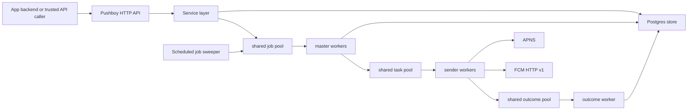

# Pushboy

[](https://go.dev/)
[](LICENSE)
[](docs/openapi.yaml)

Self-hosted push notification and Live Activity infrastructure for apps that want to own their users, tokens, jobs, and delivery state while still using APNS and FCM as the final device transports.

Pushboy started as a Go learning project and grew into a focused notification service: user and topic token storage, APNS and FCM dispatch, scheduled fanout, delivery receipts, and a shared worker pool that handles both regular pushes and Live Activity updates.

## Contents

- [Why Pushboy](#why-pushboy) - the ownership problem this repo solves
- [What It Does](#what-it-does) - APNS, FCM, topics, scheduling, receipts, and Live Activities
- [Current Status](#current-status) - what is ready and what is not yet production-safe
- [Quick Start](#quick-start) - run the service locally
- [Setup Guide](docs/setup.md) - detailed Docker, Postgres, APNS, and FCM setup
- [Docker](#docker) - build and run the container
- [Configuration](#configuration) - environment variables
- [API Examples](#api-examples) - common curl flows
- [Architecture](#architecture) - shared worker pool and storage boundaries
- [Live Activity Support](#live-activity-support) - APNS and FCM behavior
- [Comparison](#comparison) - Firebase, OneSignal, AWS SNS, and Gorush
- [Cost Model](#cost-model) - how self-hosting compares to hosted pricing
- [OpenAPI](#openapi) - machine-readable API spec
- [Production Checklist](#production-checklist) - remaining hardening work
- [Documentation](#documentation) - supporting project docs
- [License](#license) - MIT

## Why Pushboy

APNS and FCM deliver to devices, but most apps still need a backend layer that owns application users, device tokens, topics, scheduled jobs, receipts, and Live Activity state. Managed products can solve that, but they usually move the ownership boundary into a hosted platform. Pushboy keeps that orchestration layer in your infrastructure while still using APNS and FCM as the final transports.

## What It Does

- Sends visible, silent, rich, and scheduled push notifications through APNS and FCM.
- Tracks users, device tokens, topics, subscriptions, publish jobs, counters, and delivery receipts in Postgres.
- Supports user-scoped and topic-scoped fanout.
- Supports APNS Live Activities and FCM live-activity-style data updates through the same job pipeline.
- Auto-subscribes new users to a configurable broadcast topic.
- Exposes a compact HTTP API with an OpenAPI 3.1 spec in [docs/openapi.yaml](docs/openapi.yaml).
- Runs as a single binary or Docker container.

## Current Status

Pushboy is ready to package and evaluate as a self-hosted service. It is not yet safe to expose directly to the public internet.

Use it behind your own backend, private network, API gateway, or reverse proxy until native auth lands. The current API has no built-in API key, tenant isolation, rate limiting, TLS termination, or role model. Device tokens and payloads are stored in plaintext in your database.

The worker pool is also process-local today. Jobs, tasks, and outcomes flow through in-memory `Pipeline[T]` implementations, with Postgres as the system of record for users, tokens, jobs, and receipts. This is a practical single-node architecture, not yet a durable distributed queue.

## Quick Start

Requirements:

- Go 1.24+
- Postgres
- APNS `.p8` credentials and/or Firebase service-account JSON if you want real sends

Fast Docker setup:

```bash
curl -fsSL https://raw.githubusercontent.com/mithileshchellappan/pushboy/main/scripts/setup.sh | sh
cd ~/pushboy
docker compose up --build
```

To pin a specific release:

```bash
curl -fsSL https://raw.githubusercontent.com/mithileshchellappan/pushboy/main/scripts/setup.sh | PUSHBOY_VERSION=v0.0.0 sh
```

Manual local setup:

```bash
git clone https://github.com/mithileshchellappan/pushboy.git
cd pushboy
cp .env.example .env
```

Create a Postgres database and update `DATABASE_URL` in `.env`:

```bash
createdb pushboy
```

Run the server:

```bash
go run ./cmd/pushboy
```

The app runs Postgres migrations from `db/migrations/postgres` during startup. Check the process:

```bash
curl http://localhost:8080/v1/ping
```

Expected response:

```text
pong
```

## Docker

Build the image:

```bash
docker build -t pushboy:dev .
```

Or run Pushboy and Postgres together:

```bash
docker compose up --build
```

Run it with a reachable Postgres URL and mounted provider credentials:

```bash
docker run --rm \
  -p 8080:8080 \
  --env-file .env \
  -v "$PWD/keys:/app/keys:ro" \
  pushboy:dev
```

Inside Docker, `localhost` points at the container itself. If Postgres is running on your host, use a Docker-accessible hostname such as `host.docker.internal` on macOS, or put Pushboy and Postgres on the same Docker network.

The image runs as a non-root user, exposes port `8080`, copies Postgres migrations into `/app/db/migrations`, and includes a liveness health check against `/v1/ping`.

## Configuration

| Variable | Default | Notes |
| --- | --- | --- |
| `SERVER_PORT` | `:8080` | HTTP bind address. Use a private network or gateway in production. |
| `DATABASE_DRIVER` | `postgres` | Postgres is the supported runtime driver today. |
| `DATABASE_URL` | `./pushboy.db` | Set this explicitly to a Postgres connection string. |
| `WORKER_COUNT` | `10` | Master workers that fan out jobs into token batches. |
| `SENDER_COUNT` | `200` | Sender workers that call APNS/FCM. |
| `JOB_QUEUE_SIZE` | `1000` | Buffer size for in-process queues. |
| `BATCH_SIZE` | `5000` | Token batch size read from Postgres. |
| `MAX_RETRY_NOTIFICATION` | `3` | Loaded by config; full provider retry policy is still being hardened. |
| `APNS_KEY_ID` | empty | Apple Developer key id. Enables APNS when present and readable. |
| `APNS_TEAM_ID` | empty | Apple Developer team id. |
| `APNS_BUNDLE_ID` | `APNS_TOPIC_ID` fallback | iOS bundle id. Live Activities use `<bundle>.push-type.liveactivity`. |
| `APNS_KEY_PATH` | derived from key id | Path to the APNS `.p8` file. |
| `APNS_USE_SANDBOX` | `false` | Set `true` for sandbox APNS. |
| `FCM_KEY_PATH` | `keys/service-account.json` | Firebase service-account JSON. `project_id` is read from this file. |
| `BROADCAST_TOPIC_NAME` | `broadcast` | New users are subscribed to this topic when configured. |

## API Examples

Create a topic. The current router registers create/list topic routes with a trailing slash.

```bash
curl -X POST http://localhost:8080/v1/topics/ \
  -H "Content-Type: application/json" \
  -d '{"id":"broadcast","name":"Broadcast"}'
```

Register an APNS or FCM device token:

```bash
curl -X POST http://localhost:8080/v1/users/tokens \
  -H "Content-Type: application/json" \
  -d '{
    "id": "user-123",
    "platform": "apns",
    "token": "device-token"
  }'
```

Send a notification to one user:

```bash
curl -X POST http://localhost:8080/v1/users/user-123/send \
  -H "Content-Type: application/json" \
  -d '{
    "title": "Order update",
    "body": "Your driver is nearby.",
    "collapse_id": "order-123",
    "data": {
      "orderId": "order-123"
    }
  }'
```

Publish to a topic:

```bash
curl -X POST http://localhost:8080/v1/topics/broadcast/publish \
  -H "Content-Type: application/json" \
  -d '{
    "title": "Maintenance complete",
    "body": "All systems are back online."
  }'
```

Schedule a future notification with `scheduled_at`:

```bash
curl -X POST http://localhost:8080/v1/topics/broadcast/publish \
  -H "Content-Type: application/json" \
  -d '{
    "title": "Reminder",
    "body": "Your session starts soon.",
    "scheduled_at": "2026-05-01T18:00:00Z"
  }'
```

Register a Live Activity token:

```bash
curl -X POST http://localhost:8080/v1/live-activity/tokens \
  -H "Content-Type: application/json" \
  -d '{
    "userId": "user-123",
    "topicId": "orders",
    "platform": "apns",
    "tokenType": "start",
    "token": "live-activity-token"
  }'
```

Start a Live Activity:

```bash
curl -X POST http://localhost:8080/v1/live-activity/jobs \
  -H "Content-Type: application/json" \
  -d '{
    "action": "start",
    "activityId": "order-123",
    "activityType": "OrderDeliveryAttributes",
    "userId": "user-123",
    "payload": {
      "status": "driver_assigned",
      "etaMinutes": 18
    },
    "options": {
      "alert": {
        "title": "Order update",
        "body": "Your driver is on the way."
      },
      "attributesType": "OrderDeliveryAttributes",
      "attributes": {
        "orderId": "order-123"
      },
      "priority": "high"
    }
  }'
```

## Architecture



The shared pool is the important design choice. Push jobs and Live Activity dispatches enter the same job pipeline, then branch by `JobType`. Master workers page tokens from Postgres, sender workers call the platform transport, and the outcome worker writes receipts and counters back to Postgres.

Today those pools are in-memory. The `Pipeline[T]` and `Store` boundaries are intentionally small so Redis, Kafka, Postgres leasing, or another durable queue can replace the in-process implementation without rewriting the HTTP or provider layers.

## Live Activity Support

| Flow | APNS | FCM |
| --- | --- | --- |
| Token registration | Start and update tokens | Stored as update tokens |
| Start | ActivityKit `event=start`, attributes, alert, content state | Data message with `type=live_activity`, `action=start`, `activity_id`, `activity_type`, and compact payload |
| Update | ActivityKit `event=update`, content state, collapse id support | Data message with collapse key support |
| End | ActivityKit `event=end` | Data message with `action=end` |
| Scope | User or topic | User or topic |
| State | Postgres `live_activity_jobs`, `live_activity_tokens`, and `live_activity_dispatches` | Same tables |

## Comparison

This is positioning, not a benchmark. APNS and FCM are still the device transports; Pushboy is the self-hosted orchestration layer above them.

| Capability | Pushboy | Firebase Cloud Messaging | OneSignal | AWS SNS | Gorush |
| --- | --- | --- | --- | --- | --- |
| Source model | MIT open source | Proprietary Google-managed service | Proprietary hosted service | Proprietary AWS-managed service | MIT open source |
| Deployment | Self-hosted Go binary/container | Google-managed | OneSignal-managed | AWS-managed | Self-hosted Go binary/container |
| Primary shape | Push and Live Activity orchestration | Device push transport | Engagement platform | Pub/sub and mobile push service | Push gateway |
| APNS support | Yes | Yes, through FCM setup | Yes | Yes | Yes |
| FCM support | Yes | Native | Yes | Yes | Yes |
| Extra push providers | No | No | Web, Huawei, Amazon, macOS, Windows | Other AWS-supported endpoint types | HMS |
| Topic fanout | App-owned topic table | FCM topics and conditions | Audiences/segments/tags | SNS topics with mobile endpoints | No persisted app topic model |
| User-token-topic ownership | Built in | You build it | Platform-owned | You build app user mapping on top | You supply tokens per request |
| Persisted jobs and receipts | Built in | Provider message ids and Firebase tooling | Platform analytics | CloudWatch/SNS delivery status options | Stats/metrics focus |
| Live Activities | APNS ActivityKit plus FCM-style Android updates | iOS Live Activities through FCM HTTP v1 | Live Activity APIs and SDK support | Not a focused Live Activity layer | No first-class Live Activity layer |
| SDK dependency | None required for server callers | Client SDK and Admin SDK are the normal path; HTTP v1 also exists | SDK-centered for identity, delivery tracking, and Live Activities; REST API for sends | AWS SDK/API centered | REST API and CLI |
| Cost model | Your infrastructure cost | FCM itself is listed as no-cost | Priced by mobile MAU on paid plans | Free tier, then request and delivery pricing | Your infrastructure cost |
| Best fit | Apps that want a small owned push backend | Teams already standardized on Firebase | Teams that want a managed messaging product | AWS-heavy systems needing managed fanout | Teams that need a mature push gateway |
| Main tradeoff | Auth, durable queues, and metrics are still maturing | Not self-hosted; app user model remains outside FCM | Paid hosted dependency and broad product surface | Needs another app layer for user-token-topic ownership | Less opinionated about app users, topics, jobs, receipts, and Live Activities |

The practical difference: Pushboy is not trying to replace APNS or FCM. It owns the application layer those transports do not: users, device tokens, app topics, jobs, receipts, and Live Activity dispatch state.

Public docs checked for this comparison: [FCM Live Activities](https://firebase.google.com/docs/cloud-messaging/customize-messages/live-activity), [OneSignal Live Activities](https://documentation.onesignal.com/docs/en/live-activities-developer-setup), [AWS SNS mobile push](https://docs.aws.amazon.com/sns/latest/dg/sns-mobile-application-as-subscriber.html), and [Gorush](https://github.com/appleboy/gorush).

## Cost Model

Pushboy does not add a per-notification software fee. Your cost is the infrastructure you choose to run: a VM or container host, Postgres, backups, monitoring, logs, and network egress.

The important comparison is total system cost, not only provider send price. Firebase Cloud Messaging and AWS SNS can be inexpensive at the transport layer, but they still leave user ownership, token storage, topic membership, scheduling, receipts, and Live Activity dispatch state in your application. OneSignal gives you more of that product layer, but adds a hosted vendor dependency, MAU-based pricing, SDK-centered identity, and a much broader engagement platform surface.

For 1 million mobile push delivery attempts, public pricing pages currently look like this:

| Service | 1 million mobile push sends | Important caveat |
| --- | --- | --- |
| Pushboy | Infrastructure cost only; no per-send Pushboy fee | You operate the VM/container, Postgres, backups, logs, and monitoring. |
| Firebase Cloud Messaging | FCM is listed as a no-cost Firebase product | You still build and run the app-layer user, token, topic, job, and receipt system yourself. FCM supports iOS Live Activities through HTTP v1. |
| OneSignal | Not priced per mobile push send; paid mobile push is based on monthly active users | Free and Growth plans list Live Activity subscriber limits; higher Live Activity usage is custom pricing. |
| AWS SNS | First 1 million monthly mobile push deliveries are free; after that SNS pricing is based on requests plus mobile push deliveries | Direct per-device sends and topic fanout meter differently, and you still need an app layer for user-token-topic ownership. |
| Gorush | Infrastructure cost only; no per-send Gorush fee | Gorush is a push gateway; app users, topics, jobs, receipts, and Live Activity lifecycle are outside its core model. |

Pricing changes. Check the linked provider pricing pages before making a buying decision: [Firebase pricing](https://firebase.google.com/pricing), [OneSignal pricing](https://onesignal.com/pricing), and [AWS SNS pricing](https://aws.amazon.com/sns/pricing/).

## OpenAPI

The API spec lives at [docs/openapi.yaml](docs/openapi.yaml). It documents the current wire behavior, including plain-text error responses and current response field casing from Go structs.

Known API cleanup candidates before a stable public v1:

- Add first-party auth and rate limiting.
- Enforce token ownership on token read/delete routes.
- Add JSON response tags or dedicated response DTOs for stable casing.
- Add a public Live Activity status endpoint.
- Convert plain-text errors to a consistent JSON error model.
- Decide whether create/list routes should accept both slashless and trailing-slash paths.

## Production Checklist

Before marketing Pushboy as production-scale OSS, these are the real gaps to close:

- API key or JWT auth, plus documented reverse-proxy/TLS guidance.
- Durable dispatch recovery for queued and in-progress jobs after restarts.
- External queue or Postgres leasing for multi-replica deployments.
- Real readiness endpoint that checks Postgres and worker state, not just `/v1/ping`.
- CI with `go test ./...`, `go vet ./...`, `go test -race ./...`, Docker build, and a migration smoke test.
- Meaningful tests around scheduling, token fanout, provider failures, Live Activity lifecycle, and retry semantics.
- `CONTRIBUTING.md`, `SECURITY.md`, `CODE_OF_CONDUCT.md`, issue templates, and release notes.
- Metrics and operational dashboards for queue depth, send latency, provider errors, and dead tokens.
- A token retention and payload retention policy.

## Documentation

- [Setup guide](docs/setup.md)
- [OpenAPI spec](docs/openapi.yaml)
- [Postman collection](pushboy.postman_collection.json)
- [Security policy](SECURITY.md)
- [Contributing guide](CONTRIBUTING.md)
- [Code of conduct](CODE_OF_CONDUCT.md)
- [Changelog](CHANGELOG.md)
- [Postgres migrations](db/migrations/postgres)
- [Systemd example](deploy/pushboy.service)

## License

MIT License. See [LICENSE](LICENSE).
