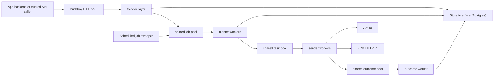

# Pushboy

[](https://go.dev/)
[](LICENSE)
[](docs/openapi.yaml)

Self-hosted push notification and Live Activity infrastructure for apps that want to own their users, tokens, jobs, and delivery state while still using APNS and FCM as the final device transports.

Pushboy started as a Go learning project and grew into a focused notification service: user and topic token storage, APNS and FCM dispatch, scheduled fanout, delivery receipts, and a shared worker pool that handles both regular pushes and Live Activity updates.

## Contents

- [Why Pushboy](#why-pushboy) - the ownership problem this repo solves
- [What It Does](#what-it-does) - APNS, FCM, topics, scheduling, receipts, and Live Activities
- [Project Status](#project-status) - current release scope
- [Quick Start](#quick-start) - run the service locally
- [Setup Guide](docs/setup.md) - detailed Docker, Postgres, APNS, and FCM setup
- [Docker](#docker) - build and run the container
- [Configuration](#configuration) - environment variables
- [API Examples](#api-examples) - common curl flows
- [Architecture](#architecture) - shared worker pool and storage boundaries
- [Comparison](#comparison) - Firebase, OneSignal, AWS SNS, and Gorush
- [OpenAPI](#openapi) - machine-readable API spec
- [Documentation](#documentation) - supporting project docs
- [License](#license) - MIT

## Why Pushboy

APNS and FCM deliver to devices, but most apps still need a backend layer that owns application users, device tokens, topics, scheduled jobs, receipts, and Live Activity state. Managed products can solve that, but they usually move the ownership boundary into a hosted platform. Pushboy keeps that orchestration layer in your infrastructure while still using APNS and FCM as the final transports.

## What It Does

- Sends visible, silent, rich, and scheduled push notifications through APNS and FCM.
- Tracks users, device tokens, topics, subscriptions, publish jobs, counters, and delivery receipts.
- Supports user-scoped and topic-scoped fanout.
- Supports APNS and FCM Live Activity flows through the same job pipeline.
- Auto-subscribes new users to a configurable broadcast topic.
- Uses Postgres as the first-class storage backend today, with a `Store` interface for adding other databases.
- Exposes a compact HTTP API with an OpenAPI 3.1 spec in [docs/openapi.yaml](docs/openapi.yaml).
- Runs as a single binary or Docker container.

## Project Status

`v0.0.0` is the first OSS preview release. It packages the core HTTP service, Postgres-backed storage, APNS/FCM dispatch, Live Activity jobs, Docker setup, OpenAPI docs, and setup scripts. The roadmap is tracked in GitHub milestones for CI, tests, auth, metrics, durable queue adapters, targeting, templates, imports, and dashboard work.

## Quick Start

Requirements:

- Go 1.24+
- Postgres
- APNS `.p8` credentials and/or Firebase service-account JSON if you want real sends

Fast Docker setup:

```bash
curl -fsSL https://raw.githubusercontent.com/mithileshchellappan/pushboy/main/scripts/setup.sh | sh
cd ~/pushboy
docker compose up --build
```

To pin a specific release:

```bash
curl -fsSL https://raw.githubusercontent.com/mithileshchellappan/pushboy/main/scripts/setup.sh | PUSHBOY_VERSION=v0.0.0 sh
```

Manual local setup:

```bash
git clone https://github.com/mithileshchellappan/pushboy.git
cd pushboy
cp .env.example .env
```

Create a Postgres database and update `DATABASE_URL` in `.env`:

```bash
createdb pushboy
```

Run the server:

```bash
go run ./cmd/pushboy
```

The app runs Postgres migrations from `db/migrations/postgres` during startup. Check the process:

```bash
curl http://localhost:8080/v1/ping
```

Expected response:

```text
pong
```

## Docker

Build the image:

```bash
docker build -t pushboy:dev .
```

Or run Pushboy and Postgres together:

```bash
docker compose up --build
```

Run it with a reachable Postgres URL and mounted provider credentials:

```bash
docker run --rm \
  -p 8080:8080 \
  --env-file .env \
  -v "$PWD/keys:/app/keys:ro" \
  pushboy:dev
```

Inside Docker, `localhost` points at the container itself. If Postgres is running on your host, use a Docker-accessible hostname such as `host.docker.internal` on macOS, or put Pushboy and Postgres on the same Docker network.

The image runs as a non-root user, exposes port `8080`, copies Postgres migrations into `/app/db/migrations`, and includes a liveness health check against `/v1/ping`.

## Configuration

| Variable | Default | Notes |
| --- | --- | --- |
| `SERVER_PORT` | `:8080` | HTTP bind address. Use a private network or gateway in production. |
| `DATABASE_DRIVER` | `postgres` | Postgres is the supported runtime driver today. |
| `DATABASE_URL` | `./pushboy.db` | Set this explicitly to a Postgres connection string. |
| `WORKER_COUNT` | `10` | Master workers that fan out jobs into token batches. |
| `SENDER_COUNT` | `200` | Sender workers that call APNS/FCM. |
| `JOB_QUEUE_SIZE` | `1000` | Buffer size for in-process queues. |
| `BATCH_SIZE` | `5000` | Token batch size read from Postgres. |
| `MAX_RETRY_NOTIFICATION` | `3` | Number of notification retry attempts. |
| `APNS_KEY_ID` | empty | Apple Developer key id. Enables APNS when present and readable. |
| `APNS_TEAM_ID` | empty | Apple Developer team id. |
| `APNS_BUNDLE_ID` | `APNS_TOPIC_ID` fallback | iOS bundle id. Live Activities use `<bundle>.push-type.liveactivity`. |
| `APNS_KEY_PATH` | derived from key id | Path to the APNS `.p8` file. |
| `APNS_USE_SANDBOX` | `false` | Set `true` for sandbox APNS. |
| `FCM_KEY_PATH` | `keys/service-account.json` | Firebase service-account JSON. `project_id` is read from this file. |
| `BROADCAST_TOPIC_NAME` | `broadcast` | New users are subscribed to this topic when configured. |

## API Examples

<details>
<summary>Create a topic</summary>

```bash
curl -X POST http://localhost:8080/v1/topics/ \
  -H "Content-Type: application/json" \
  -d '{"id":"broadcast","name":"Broadcast"}'
```

</details>

<details>
<summary>Register an APNS or FCM device token</summary>

```bash
curl -X POST http://localhost:8080/v1/users/tokens \
  -H "Content-Type: application/json" \
  -d '{
    "id": "user-123",
    "platform": "apns",
    "token": "device-token"
  }'
```

</details>

<details>
<summary>Send a notification to one user</summary>

```bash
curl -X POST http://localhost:8080/v1/users/user-123/send \
  -H "Content-Type: application/json" \
  -d '{
    "title": "Order update",
    "body": "Your driver is nearby.",
    "collapse_id": "order-123",
    "data": {
      "orderId": "order-123"
    }
  }'
```

</details>

<details>
<summary>Publish to a topic</summary>

```bash
curl -X POST http://localhost:8080/v1/topics/broadcast/publish \
  -H "Content-Type: application/json" \
  -d '{
    "title": "Maintenance complete",
    "body": "All systems are back online."
  }'
```

</details>

<details>
<summary>Schedule a future notification</summary>

```bash
curl -X POST http://localhost:8080/v1/topics/broadcast/publish \
  -H "Content-Type: application/json" \
  -d '{
    "title": "Reminder",
    "body": "Your session starts soon.",
    "scheduled_at": "2026-05-01T18:00:00Z"
  }'
```

</details>

<details>
<summary>Register a Live Activity token</summary>

```bash
curl -X POST http://localhost:8080/v1/live-activity/tokens \
  -H "Content-Type: application/json" \
  -d '{
    "userId": "user-123",
    "topicId": "orders",
    "platform": "apns",
    "tokenType": "start",
    "token": "live-activity-token"
  }'
```

</details>

<details>
<summary>Start a Live Activity</summary>

```bash
curl -X POST http://localhost:8080/v1/live-activity/jobs \
  -H "Content-Type: application/json" \
  -d '{
    "action": "start",
    "activityId": "order-123",
    "activityType": "OrderDeliveryAttributes",
    "userId": "user-123",
    "payload": {
      "status": "driver_assigned",
      "etaMinutes": 18
    },
    "options": {
      "alert": {
        "title": "Order update",
        "body": "Your driver is on the way."
      },
      "attributesType": "OrderDeliveryAttributes",
      "attributes": {
        "orderId": "order-123"
      },
      "priority": "high"
    }
  }'
```

</details>

## Architecture



The shared pool is the important design choice. Push jobs and Live Activity dispatches enter the same job pipeline, then branch by `JobType`. Master workers page tokens from Postgres, sender workers call the platform transport, and the outcome worker writes receipts and counters back to Postgres.

The `Pipeline[T]` and `Store` boundaries are intentionally small. Postgres has first-class support today, and another database can be added by implementing the `Store` interface. The in-process channel pipeline is the default queue today; Redis, Kafka, and other queue backends can be added behind the same pipeline boundary.

## Comparison

APNS and FCM are still the device transports; Pushboy is the self-hosted orchestration layer above them.

| Capability | Pushboy | Firebase Cloud Messaging | OneSignal | AWS SNS | Gorush |
| --- | --- | --- | --- | --- | --- |
| Source model | MIT open source | Proprietary Google-managed service | Proprietary hosted service | Proprietary AWS-managed service | MIT open source |
| Deployment | Self-hosted Go binary/container | Google-managed | OneSignal-managed | AWS-managed | Self-hosted Go binary/container |
| Primary shape | Push and Live Activity orchestration | Device push transport | Engagement platform | Pub/sub and mobile push service | Push gateway |
| APNS support | Yes | Yes, through FCM setup | Yes | Yes | Yes |
| FCM support | Yes | Native | Yes | Yes | Yes |
| Extra push providers | Adding support soon | No | Web, Huawei, Amazon, macOS, Windows | Other AWS-supported endpoint types | HMS |
| Topic fanout | App-owned topic table | FCM topics and conditions | Audiences/segments/tags | SNS topics with mobile endpoints | No persisted app topic model |
| User-token-topic ownership | Built in | You build it | Platform-owned | You build app user mapping on top | You supply tokens per request |
| Persisted jobs and receipts | Built in | Provider message ids and Firebase tooling | Platform analytics | CloudWatch/SNS delivery status options | Stats/metrics focus |
| Live Activity orchestration | Token, job, dispatch, and receipt state built in | HTTP v1 transport supports send, update, and end; app state is yours | Live Activity APIs and SDK support | APNS payload/header transport; app state is yours | No first-class lifecycle model |
| SDK dependency | None required for server callers | Client SDK and Admin SDK are the normal path; HTTP v1 also exists | SDK-centered for identity, delivery tracking, and Live Activities; REST API for sends | AWS SDK/API centered | REST API and CLI |

Pushboy owns the application layer above APNS and FCM: users, device tokens, app topics, jobs, receipts, and Live Activity dispatch state.

Public docs checked for this comparison: [FCM Live Activities](https://firebase.google.com/docs/cloud-messaging/customize-messages/live-activity), [OneSignal Live Activities](https://documentation.onesignal.com/docs/en/live-activities-developer-setup), [AWS SNS mobile push](https://docs.aws.amazon.com/sns/latest/dg/sns-mobile-application-as-subscriber.html), and [Gorush](https://github.com/appleboy/gorush).

## OpenAPI

The API spec lives at [docs/openapi.yaml](docs/openapi.yaml).

## Documentation

- [Setup guide](docs/setup.md)
- [OpenAPI spec](docs/openapi.yaml)
- [Postman collection](pushboy.postman_collection.json)
- [Security policy](SECURITY.md)
- [Contributing guide](CONTRIBUTING.md)
- [Code of conduct](CODE_OF_CONDUCT.md)
- [Changelog](CHANGELOG.md)
- [Postgres migrations](db/migrations/postgres)
- [Systemd example](deploy/pushboy.service)

## License

MIT License. See [LICENSE](LICENSE).
